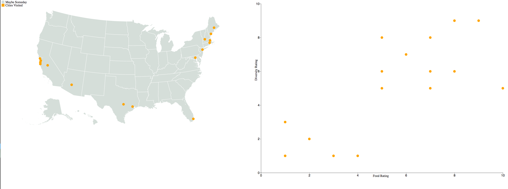

# In-Class Programming: D3 Map Brushing and Linking Tutorial
In this activity, you are going to try to follow along on creating a visualization with brushing and linking between maps and scatterplots during an in-class demonstration.

This activity is __extra credit__ - it can be worth up to two missed in-class assignments.  Making the map is worth one, and making the scatterplot and connecting it to the map is worth another.  The solution will be posted after a few days so it cannot be handed in late.

## Data

We will be visualizing made up data about Aditeya's experience with various cities that he's visted.  In particular, we are analyzing the relationship between perceived diversity, food, and geographic location.

## Setup
1. Clone this repository to your local machine. E.g., in your terminal / command prompt `CD` to where you want this the folder for this activity to be. Then run `git clone <YOUR_REPO_URL>`

1. `CD` or open a terminal / command prompt window into the cloned folder.

1. Start a simple python webserver. E.g., `python -m http.server`, `python3 -m http.server`, or `py -m http.server`. If you are using python 2 you will need to use `python -m SimpleHTTPServer` instead, but please switch to python 3.

1. Wait for the output: `Serving HTTP on 0.0.0.0 port 8000 (http://0.0.0.0:8000/)`.

1. Now open your web browser (Firefox or Chrome) and navigate to the URL: http://localhost:8000

## Features to add

First, implement the map.

1. First, we add an SVG for the map.  
2. Next, we add setup code for the projection.
3. We'll load the topology file for the US (`us.json`) and the cities visited files (`cities-visited.csv` and `statesvisited.csv`).
4. Draw the map using the topology file (see our `in-class-programming-geo` assignment for an example).
5. Draw the cities as points on a scatterplot.
6. Add brushing on the map.
7. Add a legend.
8. Make the map responsive using a `viewbox`.

Then, implement the scatterplot.

1. Add a different SVG for the scatterplot.
2. Define a margin.
3. Create the x and y scales.
4. Add circles to the scatterplot using the scales.
5. Initiate the axis.
6. Add a tooltip to the circles.

## Submission

Publish your visualization to github pages and submit a link to your repository on Canvas.